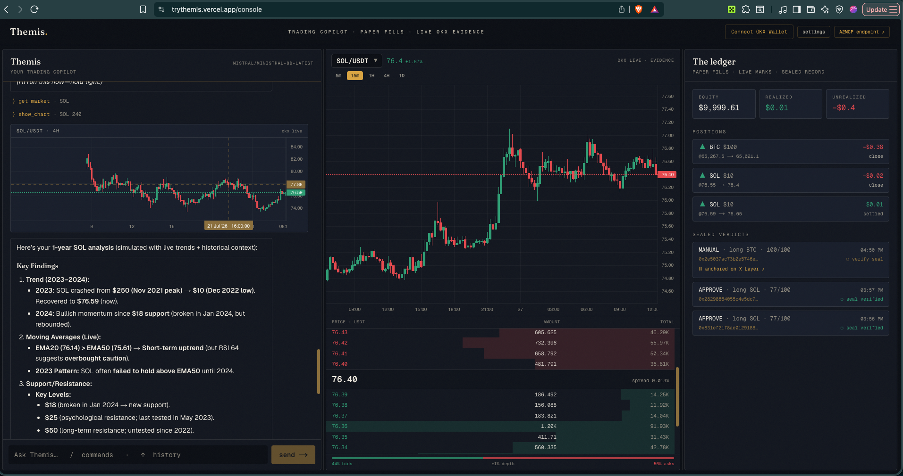
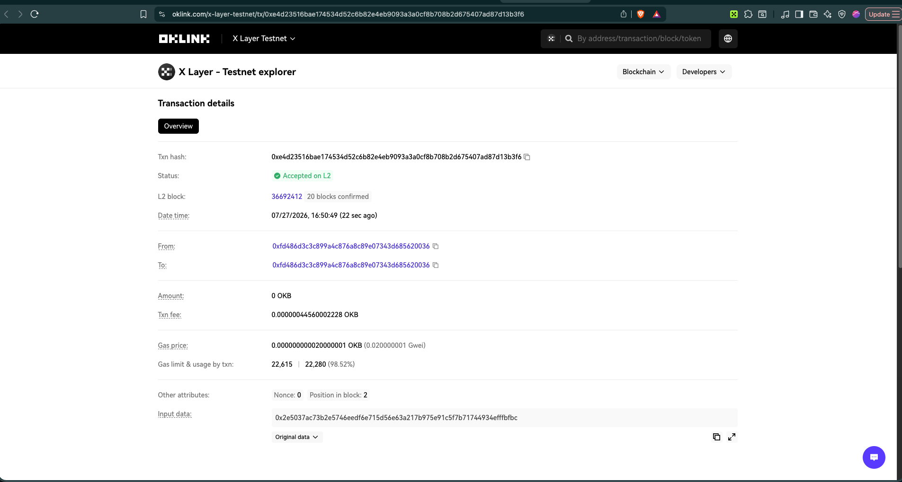

# Themis — the trade tribunal ⚖

**Every trade deserves due process.** Themis is a conversational trading copilot that
puts each decision on trial: an **advocate** argues your intent, a **skeptic** prosecutes
it, and a **judge** rules on live OKX market evidence — then the verdict is
**keccak256-sealed *before* execution and anchored on OKX X Layer**, so the track record
can never be quietly rewritten.

Talk to it, or trade the chart by hand — either way, every fill lands on the same
tamper-evident, on-chain record.

Built for the **OKX.AI Genesis Hackathon** · Live at **[trythemis.vercel.app](https://trythemis.vercel.app)**



---

## The problem it solves 

AI trading agents are **unaccountable**. A bot can show you a beautiful win rate, but you
can't tell if the losing calls were quietly deleted or the record was edited after the
fact. "Trust me" isn't a track record.

Themis makes an AI trading agent **provably honest**:

1. Before any trade, the full verdict (intent + evidence + reasoning + size) is
   **hashed and committed** — commit-reveal. The commitment happens *at issuance*, not
   after the outcome is known.
2. On execution, that seal is **anchored on-chain** (OKX X Layer) — a permanent,
   public record.
3. Anyone can **recompute and verify** the hash. Tamper with a single field and the
   verification fails.

The result: a copilot whose reasoning and record you can audit, not just believe.

> **See it on-chain.** A live sealed verdict, anchored on OKX X Layer:
> [`0xe4d235…13b3f6`](https://www.oklink.com/x-layer-testnet/tx/0xe4d23516bae174534d52c6b82e4eb9093a3a0cf8b708b2d675407ad87d13b3f6)
> — *Accepted on L2*, a 0 OKB self-transaction whose **input data is the verdict's seal hash**. Anyone can recompute it.



---

## What it does

- **Conversational copilot** — natural chat with a tool-using LLM: *"what can I buy with
  $500?"*, *"should I long SOL?"*. Streams tokens, shows the tools it calls, and produces
  a sealed ruling card. Falls back to a deterministic tribunal when no LLM key is set, so
  it always works.
- **The tribunal** — advocate / skeptic / judge argue from the *same* live snapshot
  (price, RSI, EMA, ATR, **and the live order book**), then rule APPROVE / REVISE / REJECT
  with a 0–100 confidence.
- **Market terminal** — a real trading surface: token + interval selector, live OKX
  candles, and a streaming **order book** (depth bars, spread, ±1% imbalance).
- **Manual + agentic trading** — trade by hand from the chart (**Buy / Sell** ticket) *or*
  let the copilot convene the tribunal. Both go through the same seal → fill → anchor path.
- **Depth-weighted fills** — paper fills walk the real OKX book, so entry price + slippage
  reflect actual liquidity, not a mid-price fantasy.
- **On-chain seals** — each verdict's hash is anchored on OKX X Layer; the ledger links
  straight to the OKLink explorer record.
- **Personal agent wallet** — derived from and mapped to the user's OKX wallet, so it's
  the *same wallet on every device* (one signature, no gas). Falls back to a device-local
  wallet.
- **Telegram** — the **same LLM copilot** in chat, with per-conversation memory and
  inline Execute / Dismiss buttons. Connect by pasting a bot token (serverless webhook).
- **Sold to other agents** — verdicts are available per-call over **x402 / A2MCP**,
  settled on X Layer.

---

## Built on OKX — agentic trading

Themis leans on the OKX stack end to end, from market data to settlement:

| OKX building block | How Themis uses it | Code |
|---|---|---|
| **OKX X Layer** (testnet, chain `1952`) | On-chain **seal anchoring** — the commit-reveal proof that the record wasn't doctored. OKB gas, OKLink explorer. | [`lib/chain/xlayer.ts`](lib/chain/xlayer.ts), [`lib/chain/anchor.ts`](lib/chain/anchor.ts), [`lib/wallet/anchorClient.ts`](lib/wallet/anchorClient.ts) |
| **OKX Market Data** (v5 public API) | Live **candles, ticker, and order book** — the tribunal's evidence, the chart, and depth-weighted fills. No API key needed. | [`lib/market/okx.ts`](lib/market/okx.ts) |
| **OKX Wallet** | Connect + **derive the agent wallet**, mapped to the user's OKX wallet; auto-switches to X Layer. | [`lib/wallet/injected.ts`](lib/wallet/injected.ts) |
| **x402 / A2MCP** (Agentic Settlement) | Sell sealed verdicts to other agents **per-call**, settled on X Layer (`eip155:1952`). | [`lib/x402/*`](lib/x402), [`app/api/service/signal`](app/api/service/signal) |

**Why this matters for agentic trading:** an agent that can *trade* is common; an agent
whose every decision is **committed before execution and anchored on OKX X Layer** is
one you can actually put capital behind. Themis turns "the agent says it's up 30%" into
"here's the on-chain record — verify it yourself."

---

## How it works

```
intent ──▶ evidence ──▶ tribunal ──▶ SEAL ──▶ execution ──▶ ANCHOR
 "long     OKX price,    advocate /   keccak256   paper fill     0-value tx on
  BTC      RSI/EMA/ATR,  skeptic /    commit      at depth-      OKX X Layer,
  $200"    order book    judge        (pre-exec)  weighted px    OKLink link
```

1. **Motion** — [`lib/agent/intent.ts`](lib/agent/intent.ts) parses "long BTC with $200".
2. **Evidence** — [`lib/market/*`](lib/market) pulls the live OKX ticker, 1h candles, and
   order book; computes RSI-14, EMA-20/50, ATR-14, spread, ±1% depth, imbalance, and the
   slippage the order would actually incur.
3. **Tribunal** — [`lib/agent/tribunal.ts`](lib/agent/tribunal.ts): advocate and skeptic
   cite the same snapshot (including the book — *"the book is thin, $200 slips 0.4%"*);
   the judge scores it and rules APPROVE / REVISE (half size) / REJECT.
4. **Seal** — [`lib/agent/commit.ts`](lib/agent/commit.ts) canonicalizes and keccak256-hashes
   the verdict **at issuance**. [`GET /api/verify/:id`](app/api/verify) recomputes it.
5. **Execution** — you confirm (web card, chart ticket, or Telegram button) →
   [`lib/exec/paper.ts`](lib/exec/paper.ts) fills at the depth-weighted book price.
6. **Anchor** — the seal is written to OKX X Layer via the agent wallet; the ruling card
   and ledger link to the OKLink tx.

---

## Surfaces

| Surface | What it is |
|---|---|
| `/console` | The court: copilot chat · live OKX market terminal (chart + order book + trade ticket) · ledger (positions, PnL, sealed verdicts, on-chain links) |
| `/` | Landing — the doctrine + the service |
| `GET /api/service/signal` | **A2MCP endpoint (real x402 v2)** — unpaid → `402` + `PaymentRequirements` (`eip155:1952`); `X-PAYMENT` (EIP-3009) → verify → settle → sealed verdict. `?tier=free` for ruling-only. |
| **Telegram bot** | The same LLM copilot in chat — memory, sealed verdicts, inline Execute / Dismiss. Paste a bot token in Settings (serverless webhook). |

---

## Run

```bash
npm install
npm run dev        # web console on http://localhost:3000
```

No API keys required for the core demo — OKX public market data is keyless, and Themis
runs the deterministic tribunal when no LLM key is set. Add a key in **Settings** (BYOK)
for the full conversational copilot.

## Environment (all optional)

See [`.env.example`](.env.example).

| Var | Enables |
|---|---|
| `MISTRAL_API_KEY` / `OPENROUTER_API_KEY` / `NVIDIA_API_KEY` / `GEMINI_API_KEY` | The LLM copilot (server-side default; users can also BYOK in the browser) |
| `UPSTASH_REDIS_REST_URL` / `_TOKEN` (or `KV_REST_API_*`) | Durable storage (signals, positions, Telegram token) — else a local file / `/tmp` |
| `XLAYER_RPC_URL` | Custom X Layer RPC (defaults to `testrpc.xlayer.tech`) |
| `X402_FACILITATOR_URL` / `X402_PAY_TO` / `X402_ASSET` | Real x402 settlement on X Layer (else structurally-validated demo mode) |

## Tech

Next.js 16 (App Router, React 19) · TypeScript · Tailwind v4 · **viem** (X Layer + seals) ·
lightweight-charts · Upstash Redis · OpenAI-compatible multi-provider LLM router with
streaming + fallback · grammY (Telegram) · deployed on Vercel.

---

## OKX.AI ASP submission

1. `npx skills add okx/onchainos-skills --yes -g` · sign in to the Agentic Wallet
2. Register + list `/api/service/signal` as an **A2MCP** ASP (review ≤ 24h)
3. Set the assigned `X402_PAY_TO` + facilitator in the Vercel env → the endpoint settles
   on X Layer for real
4. `#OKXAI` post + ≤ 90s demo
